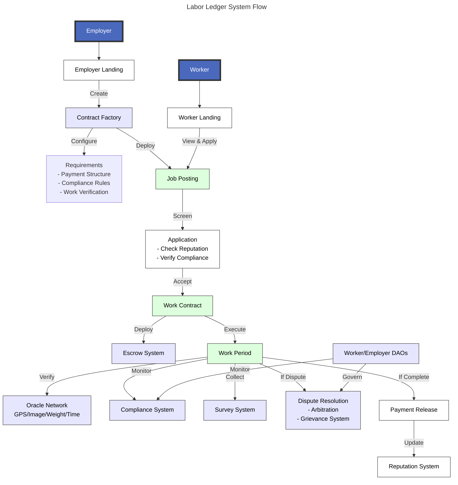

## Labor Ledger dApp Overview

Labor Ledger is a decentralized application designed to create, manage, and monitor fair working conditions through smart contracts. It combines multiple components to ensure transparent, verifiable, and equitable work arrangements while protecting worker rights and enabling efficient dispute resolution.

## Core Components

### Work Contracts

At the heart of the system is the WorkContract, which manages the relationship between workers and employers. Each contract integrates with various modules to handle: - Payments and escrow - Work verification - Grievance handling - Compliance monitoring - Survey management - Reputation tracking

### Contract Factory

The WorkAgreementFactory serves as the main entry point for contract creation, providing: - Template management for different work types - Compliance requirement configuration - Dispute settings management - Stakeholder validation - Initial deposit handling

### Decentralized Autonomous Organizations (DAOs)

The system features two complementary DAOs:

**WorkerDAO** - Serves as a mutual aid society for workers - Manages welfare fund and benefits - Provides tiered membership (BASIC → ACTIVE → CORE → ELDER) - Participates in dispute resolution - Monitors compliance standards

**EmployerDAO** - Focuses on arbitrator selection - Maintains employer representation - Conducts regular arbitrator elections - Participates in compliance setting - Manages employer reputation standards

### Reputation System

The reputation registry provides comprehensive scoring with: - Multiple scoring factors (completion, timeliness, quality, etc.) - Stake-based reputation weighting - Privacy controls for sensitive data - Score decay over time - Recovery mechanisms for low scores - Appeal process for disputed ratings - Minimum thresholds for contract participation

### Grievance System

The grievance registry provides: - Secure and private reporting channels - Multi-stage resolution tracking (PENDING → IN_MEDIATION → RESOLVED/ESCALATED) - Anonymous reporting options - Evidence management - Integration with arbitration - AI-assisted resolution preparation

### Compliance System

Monitors and enforces: - Working hours and overtime - Minimum wage requirements - Rest period enforcement - Age verification - Insurance requirements - Safety certifications - Regular auditing - Violation reporting

### Oracle Network

The system employs multiple oracle types: - GPSOracle: Validates location and attendance - ImageOracle: Processes visual evidence - WeightOracle: Verifies quantity-based work - TimeClockOracle: Manages time-based verification - MultiOracle: Combines multiple verification methods

### Payment Structures

Supports multiple payment models: - TimeBasedPayment: Hourly/shift-based work - PieceRatePayment: Unit-based compensation - MilestonePayment: Project-based deliverables - CustomPayment: Hybrid payment structures - Escrow management for payment security - Dispute-triggered payment holds

### Survey Mechanism

Integrated survey system featuring: - Industry-specific questionnaires - Random question selection - Privacy-preserving feedback collection - Compliance monitoring - Working condition assessment - Anonymous reporting options

## Integration Layer

### Interfaces

The system implements comprehensive interfaces: - IWorkerDAO & IEmployerDAO: DAO interactions - IOracle: Work verification - IPaymentStructure: Payment handling - IGrievanceRegistry: Grievance management - ICompliance: Compliance monitoring - IReputation: Reputation tracking - IArbitration: Dispute resolution - ISurvey: Feedback collection

### Security Features

-   Role-based access control
-   Stake requirements
-   Privacy controls
-   Reentrancy protection
-   Secure fund management
-   Evidence verification
-   Proof validation

## System Interaction

The workflow involves: 1. Template Selection & Contract Creation 2. Stakeholder Validation & Initial Setup 3. Work Recording & Verification 4. Payment Processing & Escrow 5. Compliance Monitoring & Reporting 6. Grievance Handling & Resolution 7. Reputation Updates & Maintenance 8. Survey Collection & Analysis

The modular design enables: - Flexible verification methods - Customizable payment structures - Democratic governance - Protected worker rights - Systematic monitoring - Efficient dispute resolution - Privacy-preserving feedback - Comprehensive compliance tracking

This comprehensive system creates a framework for fair work arrangements while maintaining transparency, protecting worker rights, and enabling efficient dispute resolution.